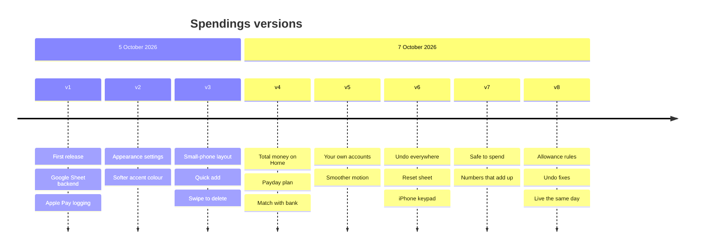

# Changelog

How Spendings has changed, version by version, newest first.

Version numbers follow the app's cache version (`VERSION` in `docs/sw.js`), so the number here is the one a phone is running. A version gets a new entry whenever that number goes up. Versions v4 to v8 reached the live app together through [PR #1](https://github.com/Bu9abi-dev/spendings/pull/1), merged on 7 October 2026. Changes to `apps-script/Code.gs` only reach the sheet after the code is pasted into Apps Script and a new version of the existing deployment is published.

## Timeline

---

## v9: Online payments from bank notifications
**7 October 2026** · sheet update needed

- Online and in-app payments are logged from your bank app's notification, through a new Shortcuts automation. Setup is in SETUP.md, section 3b.
- Only card payments are logged. Salary, transfers, refunds, ATM withdrawals and OTP messages are ignored.
- Topping up one of your own accounts with a card, like BOTIM from the ADCB card, is logged as a move between accounts, not spending.
- A tap at a card machine sends both an Apple Pay trigger and a bank notification. The sheet sees they're the same payment and logs it once.
- The sheet part needs the new `apps-script/Code.gs` pasted into Apps Script and a new version of the deployment published.

---

## v8: Undo fixes and the allowance rules
**7 October 2026** · sheet update needed

### Allowance rules
- Moving money between accounts counts as reallocating, not spending. Safe to spend no longer drops when money moves on from ADCB.
- "Allowance not moved yet" only shows for the real payday move.
- A refund into ADCB gives the allowance back exactly. Anything beyond what was spent goes to the buffer.
- A top-up from ADIB to ADCB beyond the planned move adds to Safe to spend and doesn't shrink "Move now". If it's unspent at payday, it carries into the new cycle on top of the allowance.
- Leftover allowance stays in ADCB as a buffer, and Safe to spend still resets each cycle.
- The sheet follows the same rules: the Apple Pay "left of your allowance" message, the cycle tabs and the Overview all add refunds back.

### Undo
- Leaving or entering demo mode clears undo, so a demo entry can't end up in the real sheet.
- Undoing an edit puts the entry back exactly, including its price and Needs review flag, and the sheet keeps the old price.
- Editing only the note of a USD entry keeps its price.
- Undoing a payday plan change restores the allowance amount too.

### Fixes
- Changing the cycle start day re-tags the sheet's Cycle column, and the app works out the cycle from the date on every sync.
- "Where your money is" gives archived accounts a row, so the rows always add up to the total.
- Account keys scroll when dragged to the edge, and the Activity filter chips no longer block page scrolling.
- Automatic checks for the maths and undo now run against the app's real code.

---

## v7: Safe to spend and numbers that add up
**7 October 2026**

Changes picked from a review of the app by an advisory council (reports in `council/`).

- Home shows Safe to spend (the ADCB allowance left this cycle) with a pace line: on track, or over pace per day.
- The All tab still leads with total money; Safe to spend sits on the line below it.
- "Where your money is" breaks the total into parts that add up exactly.
- The allowance capsule on All is always a percentage. This fixes a bug where 86% showed as "AED 88".
- Nafis due and "allowance not moved" can be tapped straight from the top of Home.
- The money flow drawing moved to the ADIB view.
- The allowance is set in one place (the payday plan), and the Budget row links there.
- Removing an account also removes payday plan rows that pointed at it, and it can be undone.
- Adding entries is smarter: transfers default to ADIB → ADCB, income to ADIB, a known merchant brings back its card, big amounts need a second tap, an unready Save points at what's missing, and there's an overdraft warning.
- Softer fade under the floating tab bar, a hero number that shrinks to fit, readable account badges and clearer wording.
- Fix: switching to the iPhone keyboard could take focus away from a field.

---

## v6: Undo everywhere, reset and an iPhone keypad
**7 October 2026** · sheet update needed

- Every account view has a liquid "left this cycle" capsule. On All it's a percentage of what you had this cycle.
- Undo for every change: a round Undo button by the title, Undo in every message at the bottom, and Cmd/Ctrl+Z.
- Settings → Reset sheet, confirmed by pressing and holding. The sheet keeps a hidden backup of the Ledger first.
- The amount keypad was rebuilt to look and feel like the iPhone keyboard, in light and dark.
- Keyboard friendly: switch to the iPhone keyboard, Return moves amount → place → note → save, sheets stay above the keyboard, and there are shortcuts (N, 1 to 4, arrows, /).

---

## v5: Your own accounts and smoother motion
**7 October 2026** · sheet update needed

- Add, rename, recolour or remove accounts, and set each one's Apple Wallet name. A rename carries through every past entry, the plan and settings. Removing an account first asks where its remaining money should go.
- The sheet has a new Accounts tab, and Apple Pay card matching uses it.
- A "+" key on Home adds an account, and the keys row scrolls when there are many.
- Digits roll like an odometer, the account pill follows your finger while dragging, new entries slide into lists, and payday ticks spring in.
- The large title hands over smoothly to the glass bar as you scroll.

---

## v4: Spendings v2, total money and the payday plan
**7 October 2026** · sheet update needed

A redesign of Home around all your money.

- Home leads with all your money as one number, over a bar whose segments are the real account balances. Tap or drag along it to focus one account.
- ADIB view splits into responsibilities, money still to move and emergency money. ADCB view keeps the allowance capsule.
- Payday plan (Salary, Nafis, the allowance move and responsibilities) with one-tap "It landed" and "Move now". The sheet gets a Plan tab.
- Match with bank: type what the bank app shows and the app books the difference as an Adjustment, so balances never drift.
- A to-scale drawing of how ADIB's money moved this cycle.
- Dirham sign and more realistic demo data.
- Apple Pay messages show the account balance once that account has been matched with the bank.

---

## v3: Polish for small phones
**5 October 2026**

- The add sheet fits iPhone SE and mini, with categories staying above the keypad.
- Large amounts scale down to fit.
- Quick add row for frequent purchases, and "Log this again" when editing an entry.
- Swipe left on an entry to delete it, with undo.
- Softer status colours and clearer fields in dark mode.
- Fix: a crash when an entry arrived without a date.

---

## v2: Appearance settings
**5 October 2026**

- A softer default accent colour (muted slate blue) that's gentler on black.
- Settings → Appearance: Automatic, Light or Dark theme, 8 accent colours, and a colour per card. Every option is contrast-checked in both themes.

---

## v1: First release
**5 October 2026** · first sheet setup

- An iPhone web app in Apple's design language: Liquid Glass bars, a liquid allowance capsule, spring motion, and Home, Activity, Insights and Settings tabs.
- Add and edit entries with a keypad, a Needs review inbox, offline queue that syncs later, optional Face ID lock, CSV export and demo data.
- Google Sheet backend: Ledger, Overview, a tab per pay cycle (27th to 26th) with charts, Settings and Merchants.
- Apple Pay logging from an iOS Shortcut, with card mapping, USD conversion at the 3.6725 peg, duplicate protection and merchant memory.
- Hosted on Vercel, with setup steps in [SETUP.md](SETUP.md).

Before v1, the plan was reviewed by an advisory council (`council/`).
